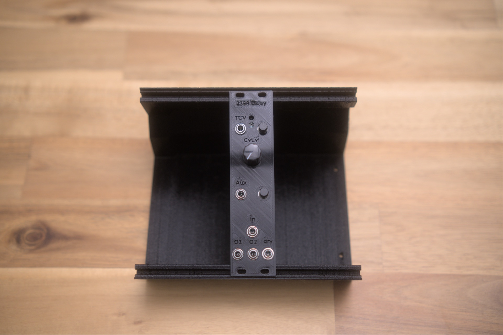

# Eurorack-PT2399-Delay

 
## Introduction
This is a delay module that uses the popular PT2399 delay chip. You would need a mixer/VCAs in order to enjoy all the features of this module. The circuit design takes circuit blocks from the Echobase pedal, Benjiaomodular's Mini Delay Eurorack module, and the Electrosmash PT2399 Delay chip analysis.
## Features
- Voltage controllable delay time (10 vpp)
- 2 Wet and 1 dry output
- Aux input for delay feedback (output 2 is normalled for feedback)
- Aux input level control
## Inputs and outputs
### Main input
This is where you will patch the signal that you want to have the delay effect
### Aux input
The aux input is normalled to wet out 2 for feedback. Aux 2 has a potentiometer to control the input level.
Another possible way to use the aux input is to patch output 2 to an effect module like a distortion module and then patch the output of the distortion module to the aux input to get distorted echo/feedback.
### Wet output 1
The wet delay output. Aux input is mixed in.
### Wet output 2
Is normalled to the aux input. A jumper can set feedback overdrive on or off.
### Dry output
A copy of the signal patched in the main input. It is buffered.

## Build status

What's ready for builders today, and what's still on the TODO list:

**Production assets** (what you need to actually fabricate and assemble a final unit)

- [x] Schematic — Rev 0.1.1 ([Eurorack-PT2399-Delay-Rev0.1.1.pdf](schematic%20pdfs/Eurorack-PT2399-Delay-Rev0.1.1.pdf))
- [ ] PCB layout — in progress — single working layout in `kicad/`, not yet separated for fab
- [ ] Gerber files for fabrication — none yet
- [ ] BOM — none yet
- [ ] Final front panel (SVG/PDF for fab) — none yet
- [ ] License — none yet

**Prototype assets** (for breadboard / perfboard / 3D-printed-panel builds before final PCB)

- [x] 3D-printed prototype panel STL — [2399_delay.stl](3D%20printed%20front%20panel/2399_delay.stl)

**Documentation**

- [x] Photos of the assembled module — see [photos/](photos/)
- [ ] Demo video — none yet
- [ ] Build / assembly instructions — none yet

Want to help fill a gap (build photos, gerbers, an assembly guide)? Open an issue or PR.
